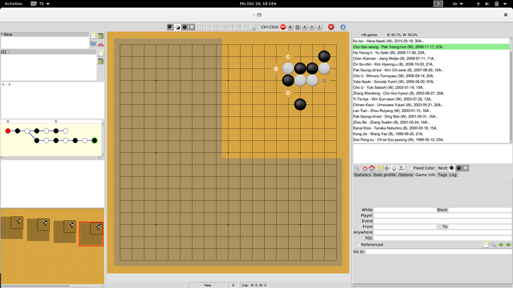

------------
Introduction
------------

Kombilo is a go database program. Its particular strength is searching for
move patterns in a collection of SGF files (like searching for all games
where a particular opening or a particular joseki is played). You can also
search for other properties of the game (like players, events, date, ...).

Features
========

* You can search for full board patterns, or for patterns occurring in a
  corner, on the side or anywhere on the board. All patterns given by
  symmetries of the board are found as well, and also - unless you disable
  it - the pattern obtained by exchanging black and white.

* Kombilo comes with a complete SGF editor: so you can add variations of
  your own, comment the game, add labels etc. The SGF editor can also
  handle collections, i.e. SGF files containing several games. The tree
  structure of the current game is shown in a separate window. You can
  rotate/mirror SGF files.

* Kombilo has built in list of references to commentaries of games in the
  English go literature. (NB: Kombilo does not come with the game records,
  but recognizes the games by the Dyer signature.) Those games in your
  database which Kombilo finds in its list are marked in the game list, and
  in the game info a reference to the journal/book which has the commentary
  is given. Currently the list contains almost 2000 references, and
  includes references to the game commentaries in all issues of Go World,
  and in most English go books with game comentaries.

* You can search for pieces of the *game information*, i.e. for player
  names, events, date, etc., and you can issue complex queries by directly
  accessing the underlying SQL database.

* After any combination of searches, you can quickly have a *date profile*
  of the current list of games displayed.

* You can refine pattern searches in many ways: by fixing who should move
  next in the search pattern, by allowing or disabling search for the
  pattern with black/white exchanged, by requiring that the pattern should
  occur before some specified point in the game (before move 50, say), by
  searching for move sequences, etc. By default, this version of Kombilo
  also searches in variations.
  The pattern search has been "parallelized" and hence can use several
  processor cores. Depending on your hardware, this results in a
  significant speed-up in comparison to older Kombilo versions.

* In addition to the graphical user interface, there is an interface for
  using the underlying functionality of Kombilo within Python scripts, or
  as a C++ library.

* Kombilo is free, and is open source. Your :ref:`contributions
  <contributing>` are welcome. Feel free to freely distribute it, and feel
  free to clone or fork the `project on GitHub
  <https://github.com/ugoertz/kombilo/>`_. I will be glad to
  consider patches you send me for inclusion into the Kombilo code.

* Kombilo has been developed with tools that are available on all major
  operating systems (at least Linux, Windows, Mac OS X), *but the current
  version has only been tested on (Ubuntu) Linux*. Probably some twists
  will be required in order to get everything running smoothly on Windows
  and/or Mac OS X; your help will be much appreciated.

* If you think some feature is missing, or if you found a bug, please open
  a ticket on GitHub, or send me an email.

