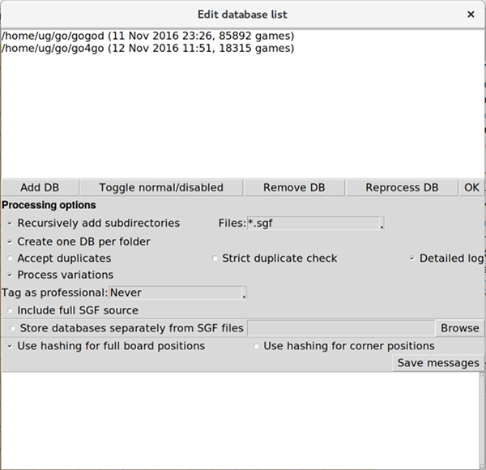

:tocdepth: 2

==============
Kombilo manual
==============

.. _install:

Installation
============

.. index::
  pair: Installation; Linux

.. _install-linux:
.. _quick-start:

Linux
-----

The following instructions cover the installation of Kombilo under Ubuntu
Linux. If you use another flavor of Linux and are somewhat familiar with it, you
will easily adapt them.

With the following commands you can install Kombilo on a Ubuntu system.
Lines starting with a ``#`` are comments - no need to type them.

There are two main steps to the installation: installing Python and the Python
packages, and then installing Kombilo as a Python package.  See below for more
details on the different steps.

::

  # Install the packages that Kombilo depends on:
  sudo apt install python-pip python-tk libsqlite3-dev libboost-dev

  # Install kombilo (you could also do that inside a virtualenv environment; if
  # you do not know what that is, you can ignore this)
  pip install kombilo

This will install kombilo (the executable will sit in ``~/.local/bin`` which
should be in your ``PATH`` environment variable, so that you can just

::

  # start the program
  kombilo

If it is not found, try invoking Kombilo by ``.local/bin/kombilo`` (in your home
directory).

Now continue with the :ref:`getting-started` section of the tutorial.

*Uninstall:* To uninstall, do ``pip uninstall kombilo``. (To also remove the
database files created by Kombilo, you should remove the databases from within
Kombilo before uninstalling.)

*Upgrading:* Upgrading from one 0.8.\* version to another can be done via pip
(``pip install -U kombilo``). If you still have an old Kombilo instance (version
0.7.\*) around, it does not interact with Kombilo 0.8.\*. You have to newly
process the SGF databases when upgrading from 0.7.\* to 0.8.\*.

.. index::
  pair: Installation; Mac OS X
.. _install-macosx:

Mac OS X
--------

In principle, installing packages using pip also works on Mac OS X.  Currently
Kombilo is distributed only in the format of a source distribution, so you would
need to make sure that in addition to Python (with Tkinter) and pip you have
a C++ compiler and the SQlite and Boost libraries required for compiling
Kombilo.  Then, you can ``pip install kombilo``.

Step-by-step instructions: Install on a Mac using MacPorts
^^^^^^^^^^^^^^^^^^^^^^^^^^^^^^^^^^^^^^^^^^^^^^^^^^^^^^^^^^

From a `post by user pleiade76
<http://lifein19x19.com/forum/viewtopic.php?f=9&t=13741#p212778>`__ to the
LifeIn19x19 forum:

::

    # The steps in some details (using MacPorts):

    # Install the following packages:

    sudo port install boost             # —> Collection of portable C++ source libraries
    sudo port install python27          # —> An interpreted, object-oriented programming language
    sudo port install sqlite3           # —> an embedded SQL database engine
    sudo port install py27-tkinter      # —> Python bindings to the Tk widget set
    sudo port install py27-pip          # —> A tool for installing and managing Python packages
    sudo port select --set pip pip27

    # Build kombilo with pip:
    pip install kombilo

    # the binary kombilo is located in:
    # /opt/local/Library/Frameworks/Python.framework/Versions/2.7/bin/

Step-by-step instructions: Install on a Mac using homebrew
^^^^^^^^^^^^^^^^^^^^^^^^^^^^^^^^^^^^^^^^^^^^^^^^^^^^^^^^^^

Adapted from a `post by Marcel Grünauer
<hhttp://lifein19x19.com/forum/viewtopic.php?f=9&t=13741#p21277://lifein19x19.com/forum/viewtopic.php?f=9&t=13741#p212778>`__ to the LifeIn19x19 forum.

This assumes that you already have installed `homebrew <http://brew.sh/>`__.
Update homebrew and the packages already installed::

    $ brew update
    $ brew outdated -q | brew upgrade

Install packages required for the build (you may have to ``brew tap
homebrew/dupes`` before)::

    $ brew install boost
    $ brew install homebrew/dupes/tcl-tk

In case you already had homebrew's python 2.7 installed::

    $ brew uninstall python

Then::

    $ brew install python --with-tcl-tk

You can test the Tk installation with::

    $ python
    >>> import Tkinter
    >>> Tkinter._test()

If you have previously already installed Pillow for macOS's own python in
/Library/Python/2.7/site-packages/ you may have to remove that first with ``sudo
pip uninstall Pillow``. The problem is that this is linked against macOS's Tcl
and Tk frameworks, whereas homebrew's python is linked against homebrew's Tcl.
This caused the message "Class TKApplication is implemented in both
/usr/local/opt/tcl-tk/lib/libtk8.6.dylib and
/System/Library/Frameworks/Tk.framework/Versions/8.5/Tk" and a "Segmentation
fault: 11".

Now you can::

    $ pip install Pillow
    $ pip install kombilo
    $ kombilo

Further remarks
^^^^^^^^^^^^^^^

As pleiade76 points out, another option is using the Windows installer inside wine.

Also see these `notes on Tcl/Tk on macs <https://www.python.org/download/mac/tcltk/>`_.

See also the :ref:`Only one mouse button <onlyonemousebutton>` option.

.. index::
  pair: Installation; Windows
.. _install-windows:

Windows
-------

There is an installer provided for Kombilo which should *just work* and which is
the easiest option. Alternatively (and that would be the cleaner way, even if
a little more cumbersome) you can also install Python 2.7 from `python.org
<http://www.python.org/>`_ and then install Kombilo as a Python package via
``c:\python27\scripts\pip.exe install kombilo``.

*Uninstall*: The installer automatically installs a program to uninstall
Kombilo.  To also remove the database files created by Kombilo, you should
remove the databases from within Kombilo before uninstalling.

*Upgrading from version 0.7*: There is no automatic upgrading. Just deinstall
the old Kombilo version and install the new one.  Versions 0.7.\* and 0.8.\* can
also coexist, so you could leave the old version until you are convinced that
the new version works. You will have to newly process your databases for 0.8.\*
when coming from 0.7.\*. Befor deinstalling 0.7.\* you should remove the
databases (in the *Edit DB list* window) because the database files will not be
removed by the uninstaller.

*Upgrading from one 0.8.\* version to another one*: There is no automatic
upgrading. It is probably safest (but should not be required) to deinstall the
old version, and then install the new one. Your configuration file and the
databases you hav inserted will be kept. There is no need to reprocess the
databases.

If you want to make changes to the program, you will need to build the program
yourself. For this, you will need Python 2.7 and a C++ compiler (Microsoft
Visual Studio C++ 2008; or MinGW32 seem to be the best choices). You will also
need to install the boost libraries and SQLite3.  Then ``pip install kombilo``
should do the job.

Alternatively, clone the git repository and proceed from there. See the
``v0.8win`` branch for the build setup that is used to create the Windows
installer, in particular the file ``appveyor.yml``.

If you want to change only the Python part, you could also start from the git
repository and add the libkomilo.pyd file (and the microsoft .dll files) from
a Kombilo instance created by the installer.

.. _development:

Development
-----------

If you want to work on Kombilo or Libkombilo yourself, you can clone the
git repository::

  git clone https://github.com/ugoertz/kombilo.git

Make sure (before ...) that you have git installed, and also install
SWIG::

  sudo apt-get git swig

Before you can compile the libkombilo extension, you need to run swig::

  cd kombilo/kombilo/libkombilo
  swig -c++ -python libkombilo.i
  mv libkombilo.py ..
  cd ../..

Compile the translation files::

  cd ../lang/en/LC_MESSAGES
  msgfmt -o kombilo.mo kombilo.po
  cd ../../de/LC_MESSAGES
  msgfmt -o kombilo.mo kombilo.po
  cd ../../../..

You are now again in the directory containing the file ``setup.py``.
Now you can install Kombilo as a Python package from the development directory
(so changes you make in the source code will be reflected immediately). You
probably want to do this inside a *virtualenv* environment::

  pip install -e .

You can then invoke Kombilo with ``kombilo`` and the SGF viewer with ``v``.

Build the documentation
-----------------------

The documentation is available on the `Kombilo website
<http://dl.u-go.net/kombilo/doc>`_. If you want to build it from the sources,
proceed as follows:

If you installed Kombilo from a ``tar.gz`` archive, then you can skip this
step. If you installed directly from its Git repository, and want to
use the documentation offline (either directly or from the Kombilo Help
menu), then you need to build the documentation yourself. If you install it
from a tar.gz file, then you can skip this step.

Kombilo documentation
^^^^^^^^^^^^^^^^^^^^^

Install `Sphinx <http://sphinx.pocoo.org/>`_ and other required packages (``pip install
-r requirements-doc.txt`` in a ``virtualenv`` would be the preferred way), or globally by ::

  sudo apt-get install python-sphinx

and in the ``doc/`` directory, run ::

  make html

to build the HTML documentation (to be found in ``doc/_build/html/``), or
 :: 

  make latexpdf

to build a pdf file. (For the latter, you need to have LaTeX installed on
your computer).

Libkombilo documentation
^^^^^^^^^^^^^^^^^^^^^^^^

Install `Doxygen <http://www.stack.nl/~dimitri/doxygen/>`_ by ::

  sudo apt-get install doxygen

and in the ``lk/doc/`` directory, run ::

  doxygen

Besides a lot of warnings, this will generate HTML and LaTeX files of the
documentation in ``lk/doc/build/``.

Updating the translation files
------------------------------

To update the template file with all messages that should be translated (the
*pot file*), do::

  xgettext -d kombilo -s *.py lang/en/LC_MESSAGES/kombilo.po

(This does not fetch the text from ``default.cfg`` that should be translated, so
if things changed there, they have to be added manually.)

Then, for all (non-English) languages, do::

  msgmerge -N lang/LANGUAGE/LC_MESSAGES/kombilo.po kombilo.po > new.po
  mv new.po lang/LANGUAGE/LC_MESSAGES/kombilo.po

You can then translate strings using a tool like ``poedit``. Finally, you have
to compile the ``po`` files to ``mo`` files, for instance using ``poedit`` or
the standard command line tool ``msgfmt``.

.. _settingupdatabases:

Setting up the SGF databases
----------------------------

Before you can start working with Kombilo, you need to add your SGF files.
For Kombilo, a database is just a directory with SGF files in it.
Select ``Edit DB list`` in the ``Database`` menu. A new window will open.

Add databases
^^^^^^^^^^^^^

In the lower section *Processing options* you can select which kind of
files you want to add, whether to recursively add all subdirectories,
whether to accept duplicates, and whether to store variations in the
database for pattern search. You can also select whether all games (or
none) of the database should be considered as pro games, or whether this
should be decided by the rank specified in the files.

**Strict duplicate check**
This option affects how Kombilo decides whether two games are a duplicate of
each other. Usually, two games are compared using the :ref:`Dyer signature
<signature-search>`. If *Strict duplicate check* is selected, Kombilo in
addition compares the final positions of the two games. In the very rare (but
existent) case that two different games have the same Dyer signature, this is
a more precise check. It has the disadvantages of being slower, and of marking
games as different where there is just a small variation in the recording of the
end game moves (which also is a rare, but existent phenomenon in the SGF
collections around).

**Create one DB per folder.**
The default behavior of Kombilo is to create one database per folder (so
descending recursively into some folder many databases might be created).
Whether this is suitable or not depends on the number of folders, and the number
of files in each folder. Unless you have special needs (and a computer with very
little or very much RAM), it is recommended to aim at databases of between 10000
and 50000 games.

If you prefer, you can specify a folder where the Kombilo files should be
stored. If you do not name a folder here, the files will be stored in the
folder containing your SGF files.

Finally, you can choose which algorithms you want to use with your
databases. (You can also :ref:`disable the hashing algorithms
<search-options>` for each pattern search, but you can only use then if you
selected the corresponding option before processing the games.)

The hashing algorithms speed up searches for full board and corner
positions respectively, on the other hand the procesing takes slightly
longer, more disk space is consumed, and Kombilo uses more memory when
running, and especially when processing new games.

**Include full SGF**
Usually Kombilo puts the *root node* of each SGF file into the database. This
contains all the game information (such as player names, event, etc.), but not
the moves themselves. From inside Kombilo this information can be accessed using
the *Anywhere* field in the game info search. If there you also want to access
the moves of the game (or if you want to use a database from your own scripts
and need that information there), select this option. Then the full SGF will be
copied to the database. Correspondingly, the database files will be much larger.
(This is not required for the pattern search, nor for opening and playing
through games from the game list.)

.. index::
  pair: Messages; Processing
.. _processing-messages:

Messages during processing
..........................

In the lower text area, Kombilo will output messages about the processed games.

* **Duplicates**: Games which are duplicates to games already in the database
  are named. Being a duplicate is tested with the method chosen in the options.
  In every case, the Dyer signature (position of moves 20, 31, 40, 51, 60, 71)
  is compared. With strict duplicate checking, in addition the final position is
  compared. Games in *disabled* databases will not be considered for duplicate
  checks. Also see :ref:`Find duplicates <find-duplicates>`.
* **SGF Error**: If there was an SGF error, Kombilo issues a warning. It tries
  to do its best to recover, and will insert as much of the game as it
  understands into the database anyway.
* **Unacceptable board size**: Currently, Kombilo processes only 19x19 games.
* **not inserted**: For games which are not inserted into the database, this
  message is appended to the error message. Otherwise, the game is inserted.

You can switch off the messages about duplicates and names of the processed
folders by disabling the *Detailed log* option.

Kombilo will create several database files: ``kombilo.db``, ``kombilo.da``,
and if you use the hashing algorithms, also ``kombilo.db1`` and
``kombilo.db2``.

If you select the option to add all subfolders of the given folder recursively
and note that processing takes too long since you have too many folders, you can
use the *Stop* button to interrupt it. *This will not stop immediately, but will
finish the currently processed folder (but not any subfolders) and write the
database.* The resulting database of course will not have all the SGF files, but
other than that is fully functional. If you want to discard it, you can of
course just delete it.

Since after clicking the *Stop* button, the currently processed folder is
completely finished, in non-recursive mode this has no actual effect.

Toggle normal/disabled
^^^^^^^^^^^^^^^^^^^^^^

If you want to temporarily exclude a database from some searches, select it
and use this button to set its status to 'disabled'.  It will then be
marked as 'DISABLED' in the database list.  Its games will not show up
anymore in the game list, and will not be found by any search.
Nevertheless, Kombilo's database files written during the processing are
still available, and if you toggle the status back to 'normal', you can use
that database again without processing it again.

Remove a database
^^^^^^^^^^^^^^^^^

If you want to remove a database from Kombilo's list completely, select it
and press this button. The database files Kombilo has written will then be
deleted. Of yourse, the SGF files themselves will not be deleted (Kombilo
will actually never change them.) If you want to add this database again
later, it will have to be processed again.

Reprocess a database
^^^^^^^^^^^^^^^^^^^^

If you made any changes to the SGF files in one of the database directories
(or added/deleted SGF files in there), you should reprocess the database,
so that the pattern search really uses the information corresponding to the
current version of the SGF files.

Reprocessing keeps all the tags on your database. This is usually the desired
behavior. If you prefer to have all tags deleted, instead of reprocessing,
remove the databases and then add them again.

Save messages
^^^^^^^^^^^^^

If there are errors in the SGF files, or if Kombilo finds duplicates, a
message is issued. The 'save messages' button allows you to save these
messages into a file, such that you can look at them later again in order
to correct the errors. (After correcting any errors, you should reprocess
the corresponding databases.)

Further notes
^^^^^^^^^^^^^

With Ctrl-click and Shift-click you *can select several databases* in the
list simultaneously. The "Toggle normal/disabled", "Remove" and "Reprocess"
buttons will then apply to all the selected databases.

Currently it is not possible to add single games to a database, or to
delete single games.

Searching
=========

There are two main ways to search in your database: by patterns occurring
in the games (:ref:`pattern-search`), and by properties written out in the
SGF file (such as the players, the result, the date, the event where the
game was played etc.).  We call the latter type of search a
:ref:`game-info-search`.

Furthermore, you can search for tags - either games that were automatically
tagged by Kombilo (e.g. handicap games), or for games that you tagged
yourself - (:ref:`tag-search`), and for the Dyer signature of a game
(:ref:`signature-search`). This is typically used less often, but may be
useful to quickly find a game whose Kifu you have in printed form.

.. _pattern-searcH:

Pattern search
--------------

Enter the pattern you want to search for by "putting down" the black and
white stones on the board, and select the size of the pattern (the
"relevant region" for the search) by clicking with the right mouse button
and dragging.

.. index::
  pair: Pattern search; Search options

.. _search-options:

Search options
^^^^^^^^^^^^^^

fixed color
  If this is set, the pattern is searched only as it is given on the board.
  Otherwise, the pattern with black and white exchanged is also considered.
  In the list of results given at the end of each line in the game list,
  hits where the colors are exchanged are marked by a minus sign following
  the move number.

next move
  Specify whether black or white should move next in the search region.

fixed anchor
  Do not "move" the pattern along the side or within the center of the
  board.

Search in variations
  Usually, Kombilo searches for the pattern in all variations in the game.
  If you switch this off, only the first ("main") variation will be
  considered.

move limit
  Find only occurrences before or at the given move number.

algorithms
  Choose whether Kombilo should use hashing algorithms for full board
  patterns and/or for corner patterns. (If you want to use them, you have
  to choose them when creating the database from your SGF files.)

date profile options
  You can also adjust some options concerning the date profiles (for the
  continuations in pattern searches, and the date profile of the whole
  database): the range that should be displayed, how fine-grained the date
  profile for the whole database should be, and the sort criterion for the
  continuations.

.. index::
  pair: Pattern search; Wildcards

.. _wildcards:

Wildcards
^^^^^^^^^

You can put down a wildcard by shift-clicking. A green dot means that this
spot may either be empty, or contain a black stone, or contain a white
stone. A black dot means that the spot may be empty or contain a black
stone, and analogously for a white dot. You can go from empty to green,
black, white, etc. by shift-clicking several times.

.. index::
  pair: Pattern search; Move sequence

Move sequences
^^^^^^^^^^^^^^

You can search for move sequences, i.e., specify that some stones of the
pattern have to be played in a certain order. To do so, first create the
final pattern of the sequence. Then put numbers as labels on those stones
that constitute the sequence that must have been played to arrive at this
pattern. You can leave stones unnumbered - this means that they have to be
present in the results before the move sequence starts.

.. warning::

  Currently there is no good way of dealing with captures, i.e., if a stone
  of your sequence captures other stones, you cannot search for the
  sequence with the current mechanism. This is only a problem of the user
  interface; a mechanism of telling Kombilo about the captured stones is
  currently missing (and will hopefully be added some time).

Further notes
^^^^^^^^^^^^^

.. warning:: Passes in the game

  In the unlikely case that one of the players passed in the middle of the
  game (but see file 1998-04-21a in the GoGoD database), the handling of
  continuations is not consistent between the different algorithms.

.. _sgf-tree:

SGF tree
--------

Kombilo can compute a whole tree of pattern search results by recursively
searching for all continuations arising in a pattern, then for the continuations
in the new patterns, and so on. In this way, you can easily compile joseki or
fuseki dictionaries. This function is available starting from an arbitrary
search pattern.

The end result will be a (possibly quite large) SGF file. In each node, some
information about the pattern represented in that node and about the
continuations will be printed.

The searches will use the game list which is active when you start the SGF tree
search. So if you (after a suitable game info search) have just all the games by
a specific player in your game list, then you can create a fuseki/joseki
dictionary for this player.

To use the SGF tree search, set up a search pattern, and then select *SGF tree*
from the *Database* menu. You can configure the SGF tree search by specifying
the following options:

Minimum number of hits
  The search is continued only for continuations with at least as many hits as
  specified by this number. Black/white continuations are considered separately.

Maximum number of branches
  If there are more continuations, only as many as specified here are
  considered. Continuations are ordered with respect to the given sort criterion
  (see below).

Depth
  The depth of the search, i.e. the highest distance (number of moves) between
  the starting position and the search position.

Comment head
  A line that will be prepended to every comment. The default, ``@@monospace``
  will make Kombilo print the comment in a fixed-width font, which is better
  suited for tabular data then the default font.

Sort continuations by
  The sort criterion for continuations.

Put results into new SGF file
  If checked, then a new SGF file is created for the results. Otherwise, the
  results are appended to the current SGF file. In the latter case, the node
  with the search pattern must not have children.

Reset game list
  If checked, the game list is reset to its state when the SGF tree search was
  started before each pattern search. Otherwise (the default), it is reset to
  its state after the pattern search for the parent node. In the first case,
  the numbers given in the SGF file (number of games, number of continuations)
  will include games where the relevant position arises with a different order
  of moves. With the default setting, only games where the position arises by
  the same order of moves as given by the SGF file are counted.

The node of the SGF file where you start the search must not have any children
before the search.

Depending on the parameters and the size of your database, the computation might
require thousands of pattern searches and thus could take quite some time. So it
is recommended to try with smaller values first to get some feeling for the
choice of parameters. You can always interrupt building the SGF tree using the
red button in the top toolbar. This will not react immediately, but will stop
the computation fairly quickly. The resulting SGF file will be incomplete, but
all the data given there is correct.

.. _game-info-search:

Game info search
----------------

In the game info search tab, you can search for properties of the game
which are written out in the SGF file.

For all text search fields (except for *Event*, *Anywhere*, *SQL*), Kombilo
returns all games where the corresponding game info starts with the given
string; i.e., if you search for *Cho* as player, you will get games by *Cho
Chikun* as well as *Cho U* (and all other Cho's).

For the *Event* and *Anywhere* fields, all games are returned where the
given text occurs anywhere in the event field or in the whole SGF file,
respectively.

You can in addition use the percent sign ``%`` as a wildcard yourself,
e.g.: if you search for *%Hideki* as the player, you will get all games of
*Matsuoka Hideki* as well as those of *Komatsu Hideki* etc.

Player
  matches black player and white player names.

from, to
  Specify dates in the form ``YYYY`` or ``YYYY-MM`` or ``YYYY-MM-DD``. If
  you want to search for a date in a different form, you need to use the
  *Anywhere* or the *SQL* search field.

SQL
  This is passed directly to the database as the ``WHERE`` clause of an SQL
  statement. Examples::

    not PW like 'Cho%'
    DATE < 1900-00-00 or DATE >= 2000-00-00

  The column names of the SQL table are ::

    PB (player black)
    PW (player white)
    RE (result)
    EV (event)
    DT (the date as given in the sgf file)
    date (the date in the form YYYY-MM-DD)
    filename
    sgf (the full SFG source).

  In SQL statements, you have to take care of *escaping* characters yourself;
  inparticular, single quotes occurring inside the search string must be
  doubled::

    PB = 'Yi Ch''ang-ho'

.. _tag-search:

Tag search
----------

The tags in the tag list have an *abbreviation* which is written in square
brackets on the left hand side of the entry. You can search for tags using
these abbreviations, and combining them using the logical operators
``and``, ``or``, ``not``, and parentheses. So for example:

* **H** searches for all handicap games.

* **S and C** searches for all games you have previously opened, and for
  which a reference to a commentary is available.

* **A and B and not C** searches for all games which carry the tags A and
  B, but not the tag C (assuming that you created these tags before; see
  below).

Just enter the search expression into the entry field below the tag list
and press enter, or click the looking glass button right of this field.

.. _signature-search:

Signature search
----------------

In order to check for duplicates in the database, Kombilo computes a
modified `Dyer signature
<http://www.andromeda.com/people/ddyer/go/signature-spec.html>`_ of every
game in the database. The signature of a game is given by the coordinates
(in SGF format) of the moves 20, 40, 60, 31, 51, 71. This almost always
characterizes a game uniquely.

In order to detect games which differ only by a symmetry of the board,
Kombilo uses a symmetrized Dyer signature: the Dyer signatures
for the game and for all rotations/reflections of the game
are computed, and then the smallest of these (with respect to
the lexicographic order) is stored.

You can also search for the signature. This might be useful
to see if a certain game is in the database if you have
the game record in some (foreign-language) book, say, and cannot read the
player's names.

Select *signature search* from the database menu, and a window will
pop up, where you can enter the coordinates of the corresponding
moves. If you click on an intersection on the board,
the corresponding coordinates will be entered in the
currently active text entry below, and the next entry will be made 
active. So you can enter the signature simply by clicking on
the places where moves 20, 40, ... were played. You can also omit
some of them (in most cases, two or three of the moves will
be enough to characterize a game uniquely).

You can print the signature of a game to the log tab by selecting it in the
game list and pressing *Ctrl-v*.

.. _export-search-results:

Export search results
---------------------

If you want to save some information on a pattern search, you
can use the 'Export search results' function in the Database menu.  This
will open a new window with a very simple text editor.  It will contain the
search pattern, the search pattern with the continuations, some statistical
information on the search, and the number of hits in each database.

You can edit the information and in the end save the text to a
file. I would be interested in hearing your opinion if other
or additional information should be given, or if the information
should be presented in another format.

Before the text editor opens, you will be asked if you want "ASCII" or
"Wiki" style output.  Usually you will choose 'ASCII', which produces plain
text.  If you want to use the output for Sensei's Library, choose 'Wiki'
instead.  You can also choose if all continuations, or if only ten of them
should be displayed.

The text editor has a button which lets you include the complete
current game list (names of players, etc.).

The game list
=============

The game list shows the current list of games. Depending on your
configuration, it shows the *white
player*, the *black player*, the *result*, the *date*. In the options menu,
you can choose to include (or exclude) the *file name* as the first item,
and the *date* as the last item.

After a pattern search, the game list shows a list of hits for each game:
the move number when the pattern occurred; the continuation (if any); a
minus sign if the pattern occurred with black/white exchanged.

Entries with different color (or background color) reflect tags set on
games. This behavior can be configured in kombilo.cfg.

Statistics
----------

The statistics tab shows information about the continuations in the most
recent pattern search. For each of the 12 most common continuation, a bar
indicates the frequency. The black/white parts of the bar indicate the
number of times that black/white played in the pattern region immediately
after the pattern was completed. The dark gray/light gray parts indicate
the number of times that black/white played in the pattern region after a
tenuki.

You can switch to *date profile statistics* by clicking the calendar icon (the
right-most icon above the statistics tabs). This will display, for the most
popular continuations, detailed information about the first/last hit (within the
period of time chosen in the *Options*), and, if there were noticeably changes
in popularity, the point in time when the move became popular (yellow marker),
the average date (green marker), the point where it became less popular (red
marker). Of course, this kind of information is pretty subjective; in other
words, it is not so clear whether the formulas used for computing the marker
positions yield relevant results. (Feedback appreciated!)

Date profile
------------

The bar diagram shows the distribution of games in the current list in
comparison to all games in the database, by date. The height of the bars
indicate the proportion of games in current list versus games in complete
database. *The height of the bars does not contain absolute information*,
i.e. even if there are only very few games in the current list, the highest
bar will have full height.

Tags
----

You can tag games in order to find them more easily and to carry through
more complicated searches.
The *Tags* tab lists all existing tags. The following ones are built into
Kombilo and are set (semi-)automatically:

* Handicap game; set automatically for all handicap games.

* Professional (a game where at least one professional player plays). You
  can choose during processing whether and in which way Kombilo should set
  this tag.

* Reference to commentary available; set automatically for all games for
  which a reference to a game comment in the literature is available. You
  can configure which books/journals should be considered here by editing
  the file ``kombilo.cfg`` accordingly.

* Seen: set automatically for all games which you opened in the SGF viewer.

If you select a game in the game list, the tags which it carries are
highlighted in the tag list. On the other hand, you can specify how tagged
games should be marked in the game list (text color/background color).

Creating new tags/deleting tags
^^^^^^^^^^^^^^^^^^^^^^^^^^^^^^^

To create a new tag, add its abbreviation (which must not yet be taken)
followed by a space and the description of the tag, like this::

  N My new tag

and click the button showing a plus sign.

To delete a tag from the tag list (and hence to remove it from all games),
enter its abbreviation and click the button showing a minus sign.

Setting/removing tags on games
^^^^^^^^^^^^^^^^^^^^^^^^^^^^^^

To specify the tags of a **single game**, select the game in the game list.
The tags which it currently carries are highlighted. You can now
select/deselect tags in the tag list by clicking them (use Control-click to
select multiple entries). To set the chosen combination of tags on the
selected games, click the second button from the left in the tags toolbar.

To add a tag to **all games currently in game list**, enter its
abbreviation into the text entry field, and click the third button from the
left. To remove a tag from all games currently in the game list, enter its
abbreviation into the text entry field and click the fourth button from the
left (depicting a broom).

For instance, you could create a tag ``A Large Avalanche Joseki``, do a
pattern search for the large avalanche joseki, and tag all games in the
resulting game list with the tag ``A``. The you can easily search for all
these games, also in combination with other tags, and you can search for
all games where the large avalanche does not occur, by searching for ``not
A`` - and again, this can be combined with searching for other tags.

.. _import-export-tags:

Importing/exporting tabs
^^^^^^^^^^^^^^^^^^^^^^^^

You can export the tags in your current database, and import them later to
a (different) database. (Use the corresponding menu items in the Database
menu.) The games are identified by the Dyer signature and
some additional hash code, so the imported tags will be set precisely on
the games *with the same moves* as the games that carried the tags when
exporting.

GoTo field
----------

Use this field (in the game info search tab) to jump to a game in the game
list quickly by entering a few letters of the current sort criterion (see
the options/game list menu). E.g., if you sort the games by date, entering
``1990`` will bring you to the games from 1999; if you sort the games by
white player, entering ``Cho`` will bring you to the games with white
player Cho.

.. _search-history:

Search history
--------------

A right-click on one of the board brings up a small menu, which lets you
delete that entry, put the entry on hold resp. release it. In the options you
can configure the maximum number of search patterns which should be remembered.
If this number is reached, the oldest patterns are deleted, unless they are on
hold.

You can also use the back button in the toolbar in the right hand column to
return to the previous search pattern. The patterns are organized in a tree;
this makes the back button work in the most sensible way. Depending on the depth
inside this search history tree, the small boards are placed with a vertical
offset. (This offset is assigned when the small board is created and not changed
afterwards; if patterns in the tree are deleted, the depth of other patterns
changes, but their vertical offset will not reflect this.)

:ref:`Optionally <search-history-as-tab>`, you can have the search history as
the bottom pane of the left hand column.

Log
---

In this tab, Kombilo prints out some information about its actions (timing
of searches etc.).

.. index:: Duplicates, Find duplicates

.. _find-duplicates:

Find duplicates
---------------

Use ``Find duplicates`` in the ``Database`` menu to produce a list of
duplicates in the database (or rather, in all the databases that are currently
active). The list will be presented in a new window and can be saved as a text
file. The duplicate check will be strict (i.e., the Dyer signature and the final
position will be compared) or non-strict (only the Dyer signatures will be
compared) depending on the setting of the corresponding processing option. This
option can be changed in the ``Edit DB list`` window or in the
``Options-Advanced`` menu.

The SGF editor
==============

Most of the SGF editor handling should be self-explanatory, so this section
is rather brief.

.. warning::

  By default, Kombilo does not ask for a confirmation before discarding
  unsaved changes, or before deleting a game. You can change this in the
  options menu, or in the ``kombilo.cfg`` configuration file.

Guess mode
----------

Activating the *guess next move* button (depicting a question mark) in the
SGF edit toolbar in the data window starts Kombilo's guess mode. That means
that clicks on the board will be interpreted as guesses - if it coincides
with the next move in the current SGF file, that move is played; otherwise
no stone is placed on the board. For obvious reasons, the *show next move*
option will be disabled as long as the guess mode is active..

When you switch to the 'guess next move' mode, a small frame appears next
to the game tree, which gives you some feedback on your guesses. If your
guess is right, it displays a green square (and the move is played on the 
board).

If the guess is wrong, it displays a red rectangle; the rectangle is
roughly centered at the position of the next move, and the closer your
guess was, the smaller is that rectangle. Furthermore the number of correct
guesses and the number of all guesses, as well as the success percentage
are given.

If you just can't find the next move, you can always use the
'Next move' button above the board to move forward in the game.

Export current position/SGF
---------------------------

Similarly to the  :ref:`export-search-results` function, you can "Export
current position" (in the database menu): this will open a text editor with
the current position.  Again, you can choose "ASCII" or "Wiki" type. In
addition, Kombilo can put the next moves (up to 9 moves) on the board,
marked by the numbers 1 to 9.

Finally, you can also export the SGF source of the current game (see the
File menu), in a text editor.

Miscellaneous remarks
---------------------

With the **rotate/flip SGF file** menu items (in the Edit menu), you can
rotate and flip the game; the SGF file is changed so as to describe the game
with the new orientation. This is useful if you want to change a game
record to obey the usual convention that the first move is in the upper
right corner.

With the **split collection** button (depicting scissors) right to the list
of files, you can split one SGF file containing several games into a
collection of files, one for each game.

With *Copy current SGF files to folder* in the Database menu you can copy
the SGF files corresponding to the games currently in the game list to some
folder (e.g. in order to use them with a different program).

**@@monospace in SGF comments**. If you put the string ``@@monospace`` as
the first line of a comment of an SGF node, Kombilo will display the
comment in a fixed width font. This is useful whenever you want to output
tabular data in a node (see the :py:mod:`sgftree` script).

.. index::
  single: Game info; edit

In the **Game info** edit window, in the *Other SGF tags* entry field you
must enter correct SGF code, i.e. special signs such as ``]`` and ``\``
must be escaped by a preceding ``\``.

Key and mouse bindings
======================

Global key bindings
-------------------

* ``Control-r`` reset game list
* ``Control-a`` clear board and reset game list
* ``Control-s`` select statistics tab
* ``Control-o`` select options tab
* ``Control-g`` select game info search tab
* ``Control-d`` select date profile tab
* ``Control-t`` select tags tab
* ``Control-p`` start pattern search
* ``Control-b`` go back to previous search
* ``Control-e`` print information about previous search pattern to log tab
* ``Control-j`` toggle :ref:`1-click mode <one-click>`

If the :ref:`search-history-as-tab <search-history-as-tab>` option is 1,
then there is also

* ``Control-h`` select search history tab

Board key bindings
------------------

* ``Left``/``right``: back/forward 1 move
* ``Up``/``down``: back/forward 10 moves
* ``Home``/``end``: to start/end of game
* ``PgUp``/``PgDown``: navigate variations
* ``Control-i``: open game info

Game list key bindings
----------------------

* ``Up``/``down``/``PgUp``/``PgDown``: move in game list
* ``Home``/``End``: scroll to left/right
* ``Return``: open selected game in viewer
* ``Control-v``: print Dyer signature of selected game to log tab

Mouse bindings
--------------

* Use Left-click to put stones on the board.
* With Right-click and drag, you select the search-relevant region.
* Use Shift + Left-click you can put (change/remove) :ref:`wildcards` on the board.
* With Shift + Right-clicking on a stone, you can go to the point in the SGF
  file, where this stone was played.
* The mouse wheel lets you scroll the game list, or scroll through the current
  game, depending on where the mouse pointer is located.
* The next button triggers a pattern search, the back button goes back to the
  previous search. (This does not work on Windows.)

Configuring Kombilo
===================

The most common options can be changed in the *Options* menu. (Choose *Edit
advanced options* for some more obscure things like font sizes etc.) In special
cases, you could :ref:`edit the file kombilo.cfg <kombilocfg>` directly (when
Kombilo is not running). Finally, the appearance can be modified by
creating/changing the file ``kombilo.app`` accordingly.

Window layout
-------------

You can change the width of the three columns of the main window, as well
as the height of the entried in the left and right hand columns by dragging the
"sashed" between them to the left/right (or up/down, resp.). Move your mouse
pointer slowly over the region between the columns; it should change its look
when you are over the sash.

See also the :ref:`maximize window <maximize-window>` option.

.. index:: Custom Menus
.. _custom-menus:

Custom menus
------------

The custom menus can be used to add your own menu entries. Upon selecting a menu
entry, Kombilo can do a pattern search for some pre-defined pattern and/or
a game info search and/or open a html file in your web browser. For example, you
could create entries for fuseki or joseki patterns, for players, or for titles. 

To edit the custom menus, select the corresponding entry in the Options menu.
You see a list of the currently existing menus, submenus and entries. The first
line with a ``*`` represents the Kombilo main menu. You can add submenus or entries
to the menus, or delete them.

When an entry is selected, you can

* Add pattern information by pressing the corresponding button. The pattern (and
  search-relevant region, and the search options) will then be associated with
  this menu entry.

* Add game info information by clicking the corresponding button. The current
  entries in the game info search window will then be associated with the
  current menu entry.

* Add a HTML file by entering the file name in the corresponding field, or by
  browsing for a file.

.. index::
  pair: Options; Menu

.. _options-menu:

Options in the Options menu
---------------------------

**Fuzzy stone placement**
Place the stones on the main board slightly off the exact point, in a
random direction, to make the position look more natural. (Well, some
people might think that it is just ugly, so you can switch it off here).

**Show next move**
In case a SGF file has been loaded, show the position of the
next move with a circle.

**Show last move**
This marks the most recent move with a small circle. Thanks to Bernd Schmidt
who provideda a patch for this. (The SGF file is not changed.)

**Show Coordinates**
Show coordinates around the board.

.. _option-discarding-changes:

**Ask before discarding unsaved changes**
If this option is enabled, Kombilo will ask for confirmation before
discarding unsaved changes in an SGF file (i.e. before deleting the
game from the game list, and before exiting Kombilo).

**Jump to match**
This controls the behaviour of the SGF viewer when you open
a game from the game lis tafter a pattern search.
If this option is checked, the viewer will jump directly to the position
where the pattern you searched for was found in that game.

**Smart fixed color**
If this option is enabled, the 'fixed color' option will be automatically
enabled when you select the whole board as search-relevant region, and
disabled when you select a smaller region. (You can nevertheless change
that after selecting the region and before starting the search.) This is
useful because if 'fixed color' is not used, Kombilo regards a position and
the same position with swapped colors as equivalent; in the case of whole
board searches that can lead to counter-intuitive results when you look at
the continuations (e.g. place a black resp.  white stone on the upper left
resp. upper right hoshi, do a whole board search without 'fixed color', and
look at the continuations).

.. _themes:

Themes
^^^^^^

Kombilo offers you to change its look according to one of a number of themes.
Which themes are available depends on your operating system. Just try them out.
The effects will be visible immediately (but the difference might not be all that large). The choice of themes depends on the operating system.

.. index:: Language, Choose language

Language
^^^^^^^^

Kombilo tries to determine the language it should use from your operating
system. If you want to change the language that Kombilo uses, you can do so
using this menu. All languages for which a translation is available are shown,
specified by their language code.  Note that after changing the language, you
must restart the program to make the change become effective.

The 'Game list' submenu
^^^^^^^^^^^^^^^^^^^^^^^

**Sorting the game list**
First of all, in the 'Game list' submenu of the Options menu, you can
choose how to sort the game list: by name of white or black player, date or
filename.

You can reverse the whole game list by selecting the *Reverse
order* option. So if you would like to sort the whole list by date, with
the most current games at the top, you could disable 'Sort per database',
choose 'Sort by date', and select 'Reverse order'.

**Show date/show filename**
Depending on where your SGF files come from, it might be interesting to
include the filename in the game list (as was done automatically in
previous Kombilo versions), or to omit it. Similarly, it might be
interesting to include the date (if it cannot be read off from the file
name, say, or to omit it). These two options allow you to control this.
Changing either of these options will reset the game list.

.. index::
  single: Options; kombilo.cfg
.. _kombilocfg:

Advanced Options
----------------

Almost all configurable options can be changed in the options menu, either
directly or in the *Edit advanced options* window.

Description of most of the options:

**Shaded stone mouse pointer**
(Don't) Show the current position of the mouse pointer on 
the board and the color of the next stone to be played
by a shaded stone.

.. _open-game-in-external-viewer:

**Open game in external SGF viewer**
By default, by double-clicking on a game in a game list, the game is opened
in Kombilo's main window. (You can open the game in an external viewer, by
shift-clicking, though). If this option is active, double-clicking opens
the game in an external viewer (v.py or an alternative SGF viewer). In that
case, shift-clicking opens the game in the Kombilo main window.

**Alternative SGF viewer**
If you want to use your customary SGF viewer/editor instead of the viewer
coming with Kombilo, enter the command to start it and the command line
options that tell it to open a certain sgf file here (put an %f where the
filename should be).  (If your viewer supports it, you can also put an %n
where the move number the viewer should jump to directly should be put.)

If your viewer supports jumping directly to a certain move in a game, you
can use %n as a placeholder for the move number of the first hit.
Similarly, if your viewer supports SGF collection, you can use %g as a
placeholder for the number of the concerning game in the given SGF file.

Under Windows, the file name is put in quotes. This is necessary if the
path contains spaces. If you don't want the quotes (or want to set them
yourself), you can use %F instead.

.. _maximize-window:

**Maximize window** (*Windows only*)
If this is active, Kombilo will try to maximize its main window on startup. This
option will become effective when you start Kombilo the next time (not
immediately).

If you choose to open games in Kombilo's external viewer, you can use the
'Maximize external viewer' option to have the viewer's windows maximized.

.. _search-history-as-tab:

**search_history_as_tab** (new in 0.7.1)
Set this to 1 in order to put the search history frame as a tab in the
right hand column. If the option is 0, then the search history will be
displayed as the bottom pane of the left hand column. The default
for this option is 1.

**Uppercase labels**
If you want to use the 'Export search results' function to
produce output for Sensei's Library, it is useful to use
lowercase labels for the continuations, since only lowercase
letters are automatically understood by Sensei's Library. 
If you do not want to do that, and find that uppercase
labels look better, you can use this option.

.. _onlyonemousebutton:

**Only one mouse button**
Some Mac OS X users have a mouse with only one button. Using this option, 
they can mark the search-relevant region with (left) mouse button click + drag.
(On Macs, this is the default; on other operating systems, selecting the search
region by right-click and drag is the default.)

**Number of previous searches remembered**
As explained above, with the 'back' button you can jump back to the previous
search. This option controls the number of previous searches that are remembered.
The default is 30, and if your machine has only a small amount of memory,
you probably should not set it much higher, or Kombilo might run out of
memory and crash.  On the other hand, if you have lots of memory, it might
be convenient to set it to a higher number, or even to 0, which means 'no
limit': all searches are remembered, as long as there is enough memory.

Some further internals such as the location of the database files could be
accessed by editing the file ``kombilo.cfg`` directly. This file is a plain
text file which you can edit yourself. *You should not edit this file while
Kombilo is running.* It is created when Kombilo is started for the first time.

.. note:: Location of the ``kombilo.cfg`` file

  Depending on your platform, the kombilo.cfg file will be stored in the
  following place:

  *Linux/Mac OS*: ``~/.kombilo/08/``, where ``~`` is your home directory; on
  Linux, this is typically ``/home/yourusername/``.

  *Windows*: In the folder ``kombilo\08\`` inside the *APPDATA* folder;
  typically *APPDATA* is something like
  ``\Users\yourusername\AppData\Roaming\``.

Lines starting with a ``#`` are comments. Most options are explained by
comments in this file.

In addition to the options, you can also define how tagged games should be
displayed (background/foreground color) in the game list, and which
references to commentaries in the literature should be displayed in the
game list.

kombilo.app
-----------

You can change some 'global properties' like background color, type and size of
the font used in the game list and in the text windows etc. by creating a file
'kombilo.app' in the same directory as ``kombilo.cfg``.  This is a plain text
file; if you change it, please make sure to save the new version as plain text
(ASCII), too.

Here is an example which shows the format of the file::

  *font:                  Helvetica 10
  *background:            grey88
  *foreground:            black
  *activeBackground:      grey77
  *activeForeground:      black
  *selectBackground:      grey77
  *selectForeground:      black
  *Listbox.background:    white
  *Text.background:       white
  *Entry.background:      white
  *Canvas.background:     grey88
  *Label.background:      grey88

Miscellaneous
-------------

The files containing the board image and the black and white stones are
``icons/board.png``, ``icons/black.png`` and ``icons/whiteN.png``, where ``N``
is a number between 0 and 15.

.. index::
  single: Contributing
  single: Reporting bugs
  single: Bug reports

.. _contributing:

Troubleshooting
===============

In case of errors, Kombilo writes some information to the file ``kombilo.err``
which is in the same directory as your :ref:`kombilo.cfg <kombilocfg>` file.

If you encounter problems, feel free to :ref:`contact me <report-bugs>`.

Contributing
============

Kombilo intentionally is an open-source project. It has profited much from
the contributions of its users in the past, and all your feedback and
contributions are very much appreciated.

Development is concentrated on the `Kombilo project page
<https://www.github.com/ugoertz/kombilo/>`_ on `GitHub
<https://www.github.com>`_.

Tell me how you like Kombilo
----------------------------

Any kind of feedback is appreciated. Tell me which parts of Kombilo you
like, and which ones need improvement. Did you use the Kombilo engine in
your own scripts? I would be glad to learn about your results.

.. _report-bugs:

Ask questions, report bugs
--------------------------

If you have any problems, feel free to ask! Either by email at
``ug@geometry.de``, or via the `issue tracker
<https://github.com/ugoertz/kombilo/issues>`_.

Ideas
-----

I have lots of ideas of new features I would like to implement, and I also
would like to learn your ideas and priorities!

Development
-----------

If you have time to delve into Kombilo development, check out the git
repository::

  git clone https://github.com/ugoertz/kombilo.git

Feel free to fork the project and do send me pull requests for improvements
or fixes you made.

Documentation
-------------

I try to maintain a reasonably complete documentation, but there surely are
gaps and probably some inaccuracies. Please notify me, if you think that
something is not explained well.

Miscellaneous notes
===================

References to commentaries
--------------------------

Kombilo has built in a list of references to game commentaries in the
english go literature. The games are referenced by the Dyer signature (a
signature assigned to the game which encodes the positions of move 20, 40,
60, 31, 51, 71, and which in practice characterizes a game uniquely); in
particular Kombilo does not contain the game records. If Kombilo recognizes
a game for which it has a reference, the corresponding line in the game
list is highlighted by a light green background (by default - you can
change this by editing the ``kombilo.cfg`` file), and a line which gives
the actual reference is appended to the game info which is shown when that
line in the game list is selected. (This is printed in blue, to show that
it is not part of the game info proper, but was added by Kombilo.)

.. image:: images/references.jpg

Currently, the list contains around 2000 references; in particular all
issues of Go World, and many English books with game commentaries.

The references are stored in the file ``references`` in the ``data`` folder
inside the main Kombilo directory. This is just a text file which you could
edit yourself. The format should be self-explanatory. You can also download
the `current version
<https://raw.githubusercontent.com/ugoertz/kombilo/master/kombilo/data/references>`_ of
this file from the Kombilo source code repository and save it as the
``references`` file.

If you want only references to sources which you own to be shown, you can
define exclude or include rules in the file ``kombilo.cfg``.

Of course, additions to the list of references are very welcome. 
I think it would make sense to add references to other journals, like the
American Go Journal, the British Go Journal, the Deutsche Go-Zeitung,
the Revue Francaise de Go, etc.

.. index:: Command line arguments

Command line arguments
----------------------

Kombilo.py
^^^^^^^^^^

You can give file names of SGF files as command line arguments, and Kombilo
will open these files upon startup. The file names should be given with the
complete path. If blanks occur in the path or in the file name, it has to
be put inside quotation marks.

v.py
^^^^

The ``v.py`` SGF viewer accepts one SGF file name as the first argument,
and optionally a move number as the second argument. The file will be
opened at the specified move number.

.. _encodings:

Encodings
---------

Kombilo can use SGF files with non-ASCII characters such as umlauts (äöü),
accents (éèê), asian language characters, etc, **but currently it can only
handle UTF-8-encoded files**. Of course, in addition the appropriate fonts
to display these characters must be installed on your computer.

.. _requirements-on-SGF-files:

Requirements on SGF files
-------------------------

There are a few requirements on the SGF files that are used in the
databases. They will be satisfied by ordinary game records, but
might not be satisfied by "strange" SGF files.

First of all, the filename of an SGF file always has to end in '.sgf'.

In addition, at the very beginning an initial position can be set up. This 
is what happens in handicap games, for example. So handicap stones are treated
correctly. It is also possible to set up an initial position consisting
of black and white stones, like a go problem. On the other hand, "during the 
game", i.e. after the first black or white move has been played, no stones may 
be added or removed except for the ordinary alternating black/white moves (and 
except for captures, of course). In particular, all stones in the initial
position have to be set up in the same node of the SGF file. Unfortunately,
in a few handicap games of the Go Teaching Ladder, this is not the case;
you will have to edit these files manually if you want to use them with Kombilo.

SGF collections: Kombilo's SGF editor can handle SGF files with several
games in them, and so can the search engine. Nevertheless it is not a good
idea to use games in that form, for performance reasons. It is better to
split the collections, and then feed them into Kombilo. The problem with
collections is that whenever the SGF file has to be read (for game info
searches or to display the game info), the whole collection has to be read
from disk, and has to be parsed.

The viewer does accept most SGF features. It displays labels, but it does not
properly display text labels with more than one letter/digit.  It ignores some
of the new SGF tags like "good for black", "bad for white", ... .

Kombilo ignores everything before the first '(;'. In particular, it will
accept files with an email header and an SGF file after that. Be aware,
though, that the header will be lost when you change the game info
of that game: whenever Kombilo writes an SGF file, it will only write
the game (resp. the game collection) itself.

Kombilo by default creates a separate database for each folder of SGF files (not
including the files in subfolders - each subfolder will get its own database).
This causes problems if you have your files in very many folders (hundreds, or
more), because at certain points Kombilo will try to open all database files at
the same time (e.g., when checking for duplicates). In that case, please uncheck
the *Create one DB per folder* option.

.. index::
  Game records; Where to find

.. _find-game-records:

Where to find game records
--------------------------

Here are some sources of game records:

* `GoGoD encyclopedia <http://gogodonline.co.uk/>`_ has more than
  85,000 games.
* `Go4go <http://www.go4go.net/v2/>`_ has more than 40,000 games.
* `Games of strong players on KGS <http://www.u-go.net/gamerecords/>`_
* `List of links to SGF collections on u-go.net <http://u-go.net/links/gamerecords/>`_
* `List of links to SGF collections on Sensei's library
  <http://senseis.xmp.net/?GoDatabases>`_

