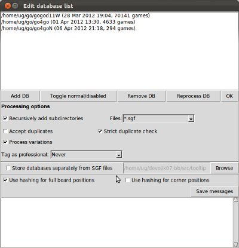
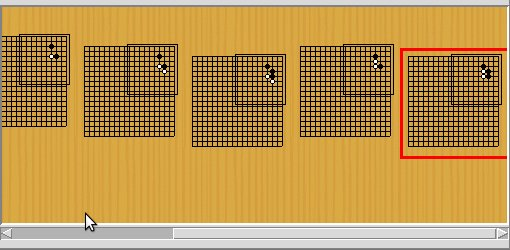

======================================
Tutorial: Getting started with Kombilo
======================================

This document give you a step-by-step tutorial to setting up Kombilo and to
getting started with the program.

.. _getting-started:

Getting started
===============

First you need to :ref:`install <install>` the program. For Windows, there is an
installer which will set up everything for you. For other operating systems, or
if there are problems, look at the pertaining instructions:
:ref:`install-linux`, :ref:`install-windows`, :ref:`install-macosx`.

When you start Kombilo, the **main window** will open, with a go board in
the middle, some widgets which belong to the SGF editor on the left, and
the game list on the right.

.. image:: images/mainwindow_new.jpg

You can change the sizes of the columns by dragging the *sashes* between
them, and similarly for the horizontal panes in the left hand column.

The first thing you have to do now is to add SGF files to the database
list; choose the *Edit DB list* command in the Database menu.

A *database* corresponds to a directory of SGF
files; it contains all the SGF files in that directory. Kombilo does not
come with any games. You can either download a game collection
(:ref:`find-game-records`) from the internet, or buy a commercial
one. The `GoGoD encyclopedia <http://gogodonline.co.uk/>`_ comes with more
than 70.000 at the time of writing, and is highly recommended.

See also the section about :ref:`requirements-on-SGF-files`
in order to understand which kind of SGF files the program can handle. 

Check (and change, if necessary) the options - mainly whether all
subdirectories should also be added, and then use the ``Add DB`` button to
select a directory of SGF files. You can add several directories one after
the other. From a performance point of view, it is best not to have too
many databases, but rather to group your SGF files into few databases.

When you add a directory for the first time, the SGF files will be
'translated' into a format that makes the search more efficient.  This
processing takes quite some time; if you have thousands of games, it will
take a couple of minutes even on a very fast machine.  But this has only to
be done once. The data will be written to several .db files in the same
directory. (Note: this processing is much faster now than it was in Kombilo
0.5 and earlier versions.)

The sgf files remain in the directory, and Kombilo will not change them
(unless you change the game info or edit the games yourself, of course).
After the processing, the pattern search function actually does not use
them anymore, but they are needed if you want to play through games with
the SGF viewer.

After having added one or more databases, close the ``Edit DB list`` window
using the ``OK`` button.

.. warning:: Character encodings

  Currently, this version of Kombilo works well only with **UTF-8** encoded
  files. Most SGF files produced in the western world are pure ASCII (which
  is a subset of UTF-8, and in particular can be handled by Kombilo), but
  many SGF files with asian characters are encoded using different
  character encodings and hence cannot be fed into Kombilo right away. This
  issue will hopefully be resolved soon. See :ref:`encodings`.

Searching for patterns
======================

Now the game list should contain some files, and you can start the first
search.  Place stones on the board by clicking. Ctrl-click to remove
stones, and Shift-click to place :ref:`wildcards <wildcards>`.

With the right mouse key (click and drag) you can select the
search-relevant region; the rest of the board will be grayed out.

Everything outside that region is ignored: on the one hand it does not
matter if there are additional stones on the main board, on the other hand
all games will be found which feature the given pattern in the relevant
region, no matter what else is on the board.  Of course, mirroring and
rotating the board is automatically taken into account.

.. image:: images/expl_color.jpg
  :align: left

Switch between placing black and white stones alternatingly, or stones of
one color only by using the left most buttons in the toolbar.

When no region is selected, the whole board is relevant.

After defining the pattern and the relevant region, just click the search
button (the looking glass in the row of buttons directly below the game
list), or press ``Control-p``.  In order to go back to the complete game
list, use the "reset game list" button - the leftmost button below the game
list, or press ``Control-r``.

If you click on a game in the game list, the game info (players, result, komi,
event, date etc.) is displayed below the game list.

.. image:: images/results.jpg

By double-clicking on a game in the game list, you load the game to the SGF
editor and you can look at that game. You can also start the viewer by
selecting a game (by a single click) and pressing the return key.  If you
prefer to open the game in a new window, use Shift-Click instead of
double-clicking; cf. the :ref:`corresponding option
<open-game-in-external-viewer>`.

If you prefer, you can use your customary SGF editor instead of the SGF
viewer coming with Kombilo; use the 'Alternative SGF viewer' command in the
Options menu. 

By clicking on a game with the right mouse key, a window will pop up where
the complete game info is displayed, and can be edited. **Note:** By
pressing OK in this window, the game info is written to the original SGF
file.

In the ``Statistics`` tab in the lower portion of the right hand column,
some statistics will be shown about the continuations in the given
position.

In the first line you find the number of hits (which, obviously,
can be bigger than the number of games in the list); after this number,
in parentheses, is the number of matches with colors as on the board 
respectively reversed colors. Finally, you get the B/W winning 
percentages corresponding to the hits (i.e. a game where the pattern
occurs several times, is counted that often).

Below some information on the continuations in the search position
is given. For the ten most frequent continuations, you get

* the number of hits in which this continuation is played

* graphically, it is shown, how often white played at this point
  after a tenuki (light gray), how often white played there directly
  after the pattern was finished (white), how often black 
  played there directly after the pattern was finished (black),
  and finally how often black played after tenuki at the given point.

* finally, below the letter labelling the corresponding point on the board
  (use the button with the labeled white stone to display the labels on the
  board), you get the black winning percentage for white playing at this
  point, and then the black winning percentage for black playing there.
  (Because there is not enough space, the winning percentage for white is
  not given, but of course (neglecting jigos etc.) it will be 100% - black
  winning percentage.

.. image:: images/statistics.jpg

The labels are ordered by the number of occurrences of the corresponding
continuation. (Unless there were already labels present in the search
pattern: in that case Kombilo will use those labels to refer to the same
intersections, and thus will not sort by frequency.)

If you have a sufficient number of games in your databases, this lets you
create fuseki and joseki dictionaries very easily: The color of the label
indicates whether black or white (or both, depending on the game, in case
of the gray labels) played on this point. See :py:mod:`sgftree`.

After a search, you can clear the board with the *start* button above the
board.  You can reset the game list (such that it contains all the games
again) with the *reset game list* button in the toolbar below the game
list, or by pressing ``Control-r``.  In the file menu, you can also choose
to do a "complete reset" - that will reset Kombilo to the state right after
it started up.

Pattern search options
======================

There are several buttons to customize the search in the game list
window: 

.. image:: images/searchoptions.jpg

Usually the pattern obtained by reversing the colors is 
searched for too, but you can disable that with the 'fixed color'
option.

As a default, Kombilo uses the 'smart fixed color' option,
which automatically enables 'fixed color' for whole board
searches, and disables it for all other searches. You can change
that in the :ref:`options-menu`.

Furthermore, for a pattern on the edge or in the middle of the board,
the program also looks for translations; this can be disabled
by the *fixed anchor* option.

With the *black/white*, *black* and *white* buttons in the line below 
you can limit the search to patterns where black plays next or
white plays next. This is sometimes useful, in particular for joseki
searches with very few stones on the board. The default is to allow either
a black or a white continuation (or no continuation at all).

Finally, you can impose a move limit, such that only games
are found where the pattern occurs before the given limit.

You can also add wildcards to the search pattern, by shift-clicking on 
some point. These will be marked by small green circles, and mean that
in the search these points may be either empty or contain a stone of
either color.

For example, the following pattern finds all kos (that are not on the edge):

.. image:: images/search_patt_ko.jpg

Game Info search
================

If you are looking for games by a particular player, from a particular
event or from a certain time period, you can use the 
game info search.

.. image:: images/isearch.jpg

The games have to match all the requirements (Black Player, Event, ...)
simultaneously. The corresponding string has to occur at the beginning of
the data, but you can use the percent sign ``%`` as a wildcard, i.e. if you
enter '% Chikun' as player, games where Cho Chikun played will be found.

The 'Anywhere' entry is simply a text search in the SGF file. This allows
you to search for the result (use 'RE[W' or 'RE[B'), for games which
have a game comment (use 'GC['), etc.

The SGF editor
==============

You place stones by clicking (with the left mouse key) on an
intersection. The four left-most buttons above the board control if you
play black/white (resp. white/black) stones alternatingly, or if you place
black (resp. white) stones, in order to set up a position.

In order to delete stones or to place labels, you have to select the
appropriate tool among the 'edit tools' in the data window. Then you can
perform the corresponding operation by holding down the Control key and
clicking on an intersection.

With Shift + right-click you can go to the node where some move was/will 
be played.

Kombilo's main board has two more features which are related to the pattern
search: You can place wildcards on the board (resp. delete them) by
shift+click, and you can select the relevant area for the pattern search by
clicking the right mouse key, and dragging.

.. image:: images/boardbuttons.jpg
  :align: right

The navigation keys above the board let you move around in the current game
record: one move back, one move forward, 10 moves back, 10 moves forward,
to the beginning resp. to the end of the current game. All these can also
be done by using keys: left, right, up, down, home, end.

If the current SGF file contains variations, you can switch between the
alternatives for the current move with the PageUp and PageDown keys.

You can also use the SGF editor without the database functionality by
starting the program ``v.py``.

The SGF data column
-------------------

File list
^^^^^^^^^

.. image:: images/gamelist.jpg
  :align: right

At the top of the right hand column, there is a list of all SGF files that
have been loaded during the current session. The currently active file is
highlighted; you can change that by clicking on another item in the list.
The buttons on the right let you create a new file, open a file from disk,
delete a file, or split a collection. Deleting a file just means deleting
it from this file list. The file on your disk will not be deleted.
Splitting a collection serves to split an SGF file which contains several
games into many files with one game each. You will be asked for a filename,
and the files will then be saved under the names filename0.sgf,
filename1.sgf, filename2.sgf, etc.

If changes have been made to a file after it has been saved, the file name
is preceded by a \*.

.. warning::

  By default, Kombilo will not ask you if you want to save the changes, so
  you have to pay attention to the \*, and save the files yourself, if you
  want to keep the changes! You can change this behavior by selecting the
  :ref:`corresponding option <option-discarding-changes>`.

Game list
^^^^^^^^^

Below the file list there is a list of game records in the current SGF
file. (Usually SGF files contain just a single game, so chances are that
you will never use this pane. You can just minimize it to height 0.) You
can select games by clicking on them, and change the order by drag and
drop.  The buttons on the right let you create new games and delete games
from the list.

Game info
^^^^^^^^^

This shows part of the game information (names of players, result, date,
etc.) of the current game. In order to see the full game information, or to
edit it, use the button depicting a looking glass and a sheet of paper
above the go board.

Game tree
^^^^^^^^^
.. image:: images/gametree.jpg

Here the tree structure of the current game is shown. Nodes with a
black/white move are shown black resp. white; others are red. Nodes with a
comment or a label on the board have a small blue dot in the center.

The green mark shows the current move (i.e. it corresponds to the position
currently shown on the main board).

By clicking on a node, you can go to the corresponding move.

Comments
^^^^^^^^

In this window the comments which the SGF file contains for the current node are
displayed.

Kombilo: Search history
^^^^^^^^^^^^^^^^^^^^^^^

This frame contains a list of previous search patterns. 
Click on one of the small boards to go back to the corresponding pattern
search (i.e. the pattern and the game list are restored to what they have
been right after the search).

A right-click on one of the board brings up a small menu, which lets you
delete that entry, put the entry on hold resp. release it.

The game list column
====================

At the top, the game list window shows the number of games currently in the
list, and the B/W winning percentages (the two numbers will often not
add up to 100% since there might be Jigo's, unfinished games etc.)

Right below the list, there is a frame where (part of) the game information
for the currently selected game in the list is shown (just click on a game
to select it).

At the bottom, there is a "notebook" with one sheet ("tab") each for the
pattern search statistics, the pattern search options, the game info
search, the date profile, tags and for messages.

Right above the notebook, there is a toolbar with several buttons and
switches.

.. image:: images/backreset.jpg

The 'home' button resets the game list, so that it includes all the games
in the database again. The 'search' button starts a pattern search. The
'back' button jumps back to the previous search: the position on the board
is restored as well as the game list. (Previous search patterns are also
shown on small boards in the "History" frame of the data window.)

With the button depicting a labeled white stone, you can display the labels
showing the continuations in the current search pattern (resp. remove them
again). 

The button depicting a mouse toggles the *1-click mode*.  If this mode is
active, every click on the board triggers a search. That can be quite
practical in order to play through joseki sequences, say.  If this mode is
inactive, single clicks will just place a stone on the board. In this case,
you can place a stone and start a search at the same time by
double-clicking.

Check the *fixed color* checkbox to disable searching for patterns where
black/white are exchanged. Use the *Next* option to specify that either
player or black or white should move next in the selected area.

In the game info search window, you see entry fields for the search
criteria: white/black player, player, event, etc.  If you select the
'Referenced' option, only games with a reference to a commentary will be
shown.  The "clear" button clears all entries; the back and forward buttons
restore the entries from previous searches. Unlike the back button for
pattern searches, they do not change the game list. Last but not least,
there is the button to start a search; you can also start the search by
pressing Enter in one of the entry fields.

The **Go to: field** makes it easy to find specific games in the game list
quickly.  The 'Go to' entry always works with respect to the current sort
criterion.  Let's assume that you sorted the database by date. Then
entering something in the 'Go to' field will jump to the closest game in
the game list the date of which starts with what you entered. 

Date profile of the database
----------------------------

.. image:: images/dateprofile.jpg

The *Date profile* tab shows you how the games which are currently in the
game list are distributed over time. The height of each bar shows the
proportion of games in the current game list with respect to all games in
the database in the same time period. Say you do a pattern search, and then
select the *date profile* tab. If one bar is twice as high as another one,
then this means that in the first time period the pattern was played twice
as much as in the second one. The height of the bars does not contain
information about the absolute number of games in the current game list.
However, these numbers are printed above the bars (number of games in
current list/number of games in whole database).

Computing the date profile is pretty slow (much slower than a pattern
search), so you should keep this tab open only as long as you are really
interested in the results.

Tags
----

You can tag games in order to find them more easily and to carry through
more complicated searches.

.. image:: images/tags.jpg

The *Tags* tab lists all existing tags. The following ones are built into
Kombilo and are set (semi-)automatically:

* Handicap game; set automatically for all handicap games.

* Professional (a game where at least one professional player plays). You
  can choose during processing whether and in which way Kombilo should set
  this tag.

* Reference to commentary available; set automatically for all games for
  which a reference to a game comment in the literature is available. You
  can configure which books/journals should be considered here by editing
  the file ``kombilo.cfg`` accordingly.

* Seen: set automatically for all games which you opened in the SGF viewer.

If you select a game in the game list, the tags which it carries are
highlighted in the tag list. On the other hand, you can specify how tagged
games should be marked in the game list (text color/background color).

Tag search
^^^^^^^^^^

The tags in the tag list have an *abbreviation* which is written in square
brackets on the left hand side of the entry. You can search for tags using
these abbreviations, and combining them using the logical operators
``and``, ``or``, ``not``, and parentheses. So for example:

* **H** searches for all handicap games.

* **S and C** searches for all games you have previously opened, and for
  which a reference to a commentary is available.

* **A and B and not C** searches for all games which carry the tags A and
  B, but not the tag C (assuming that you created these tags before; see
  below).

Just enter the search expression into the entry field below the tag list
and press enter, or click the looking glass button right of this field.

Creating new tags/deleting tags
^^^^^^^^^^^^^^^^^^^^^^^^^^^^^^^

To create a new tag, add its abbreviation (which must not yet be taken)
followed by a space and the description of the tag, like this::

  N My new tag

and click the button showing a plus sign.

To delete a tag from the tag list (and hence to remove it from all games),
enter its abbreviation and click the button showing a minus sign.

Setting/removing tags on games
^^^^^^^^^^^^^^^^^^^^^^^^^^^^^^

.. image:: images/tag_buttons.jpg
  :align: right

To specify the tags of a **single game**, select the game in the game list.
The tags which it currently carries are highlighted. You can now
select/deselect tags in the tag list by clicking them (use Control-click to
select multiple entries). To set the chosen combination of tags on the
selected games, click the second button from the left in the tags toolbar.

To add a tag to **all games currently in game list**, enter its
abbreviation into the text entry field, and click the third button from the
left. To remove a tag from all games currently in the game list, enter its
abbreviation into the text entry field and click the fourth button from the
left (depicting a broom).

For instance, you could create a tag ``A Large Avalanche Joseki``, do a
pattern search for the large avalanche joseki, and tag all games in the
resulting game list with the tag ``A``. The you can easily search for all
these games, also in combination with other tags, and you can search for
all games where the large avalanche does not occur, by searching for ``not
A`` - and again, this can be combined with searching for other tags.

Analyzing a game
================

If you want to analyze a game of your own, just load it into the main board
with the 'Open' command in the file menu (or use the 'Open' button next to
the file list in the data window). Use the navigation buttons to navigate
through the file, and search for patterns appearing in your game: for the
first few moves you may want to do a whole board search, in order to see up
to which point the fuseki you played also occurs in professional games, and
afterwards you have to select an appropriate relevant region.

You can also load a fuseki or joseki dictionary For example, Kombilo works
quite well with `Kogo's joseki dictionary
<http://waterfire.us/joseki.htm>`_.  To navigate all the variations, you
should enable the 'Show next move' option.

Guess next move mode
====================

One fun way to study go is to replay professional games by guessing the
next move. If you click on the corresponding button in the SGF edit toolbar
in the data window, you enter Kombilo's guess mode. That means that clicks
on the board will be interpreted as guesses - if it coincides with the next
move in the current SGF file, that move is played; otherwise no stone is
placed on the board.

When you switch to the 'guess next move' mode, a small frame appears next
to the game tree, which gives you some feedback on your guesses. If your
guess is right, it displays a green square (and the move is played on the 
board).

.. image:: images/guessrightwrong.jpg
  :align: left

If the guess is wrong, it displays a red rectangle; the rectangle is
roughly centered at the position of the next move, and the closer your
guess was, the smaller is that rectangle. Furthermore the number of correct
guesses and the number of all guesses, as well as the success percentage
are given.

Of course, if you just can't find the next move, you can always use the
'Next move' button above the board.

Further notes
=============

Using Kombilo with non-latin (Unicode) characters
-------------------------------------------------

Kombilo works out of the box with UTF-8 encoded SGF files, but currently
not with other encodings.

How can I reset the correct/wrong counter in the "guess next move" mode?
------------------------------------------------------------------------

Currently, you can only reset the counter by quitting and reentering the
"guess next move" mode.

